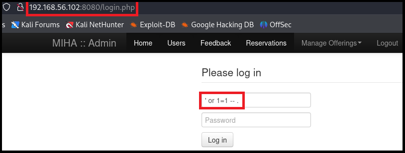
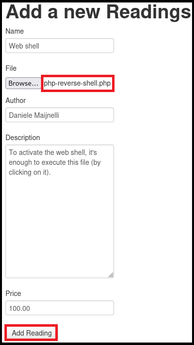
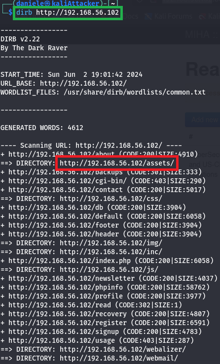
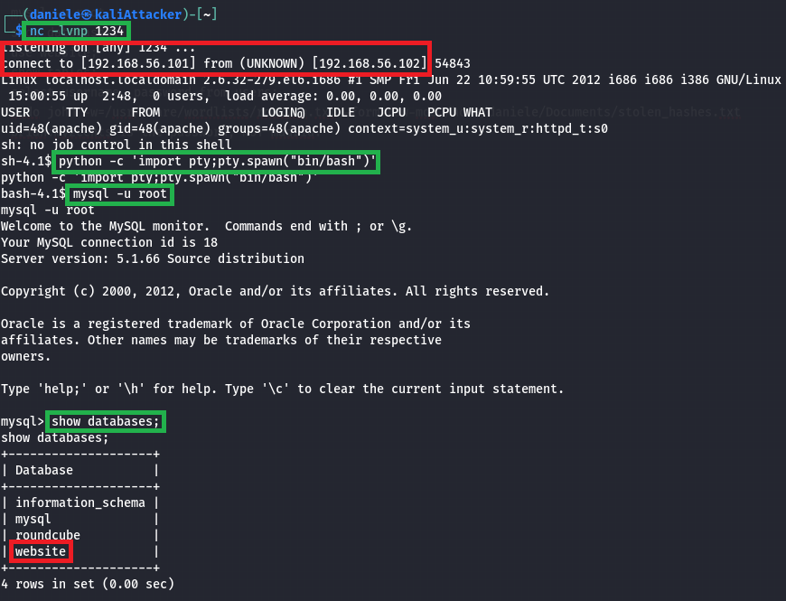
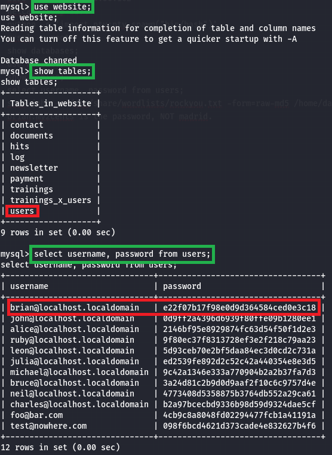
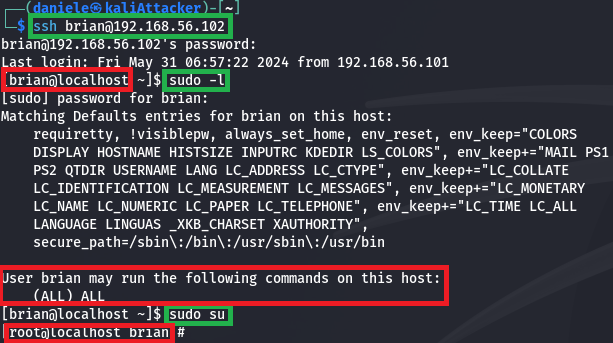

# **Attack on CTF7 Virtual Machine**

**Daniele Maijnelli**

---


### **Preliminary information**

- The attacking machine is a Kali VM in the same network of the target machine
- The target machine is a VM that can be downloaded at https://www.vulnhub.com/entry/lampsecurity-ctf7,86/
- The **objective** of the attack is: Gaining root privileges on the target machine
- The **threat model** is: The attacker can communicate with the target machine
- The attack will be described in terms of the MITRE ATT&CK framework (Tactics and Techniques)
- This activity is based on the walkthrough that can be found at the following link
https://www.hackingarticles.in/hack-the-lampsecurity-ctf-7-ctf-challenge/

### **Discovery**

The first phase consists in finding information about the target that is useful for performing initial access. I will use `nmap`, a network exploration tool installed by default on Kali. The first command to execute is `ip addr`, that allows to see the IP address of the attacker machine (`192.168.56.101`) and to obtain the network number of the network that connects the two machines (`192.168.56.0/24`). To obtain the IP address of the target machine, I execute `nmap 192.168.56.0/24`, a command that tries to contact all the IP addresses in the specified network number and lists for each of them the reachable port numbers. This command allows to execute the following two techniques.


#### Remote System Discovery 

The IP address of the target machine is `192.168.56.102`. Since the machines are not connected to the Internet, there is no gateway, they can only communicate between themselves.

#### Network Service Discovery

There are several ports reachable, the ones of interest to us are: 
- 80 and 8080 for HTTP traffic (these will be used in the first parts of the attack)
- 22 for ssh (this will be used at the end of the attack to connect with valid credentials)

By visiting the home page (URL: ```http://192.168.56.102```) on the browser, it appears that there is nothing useful to continue the attack, so I try contacting the other port number (URL: `http://192.168.56.102:8080`). Here there is a login page that can be abused to gain initial access.

### **Initial Access**

#### Exploit Public-Facing Application
To proceed, since I don't know the credentials, I try several usernames with special characters hoping that the system will leak information about the internal functioning through some error messages. Trying with `'` as username and without inserting a password, the system gives the following error message:

`Invalid query: Yout have an error in your SQL syntax; check the manual that corresponds to your MySQL server version for the right syntax to use near "'" AND password=md5(") and is_admin=1' at line 1`
`Whole query: select * from users where username='" AND password=md5(") and is_admin=1`

Now I know that the target machine is using MySQL and also the whole query that is being used. To access as admin, I perform a SQL injection, that is inserting a username value carefully constructed (the exploit is the HTTP request that answers the form, the payload is the username value `' or 1=1 -- .`) to cause a DBMS to consider it as SQL code inside a query instead of a normal username. For the password, it's possible to leave the field empty, it is not relevant since it will not be considered due to the injected exploit. The exploit works because the query executed in the target machine after the injection becomes `select * from users where username=' or 1=1 `, the remaining code will be considered as a comment due to the `-- .` part of the exploit, so it won't be executed. 



### **Persistence**

#### Server Software Component &rarr; Web Shell

In order to have a persistent way to execute code on the target machine, now the goal is to upload a web shell on the website, the first step is to find a page that allows to upload files. Exploring the website, eventually it will be discovered that such a page is reachable for logged users by clicking on "Manage Offerings" &rarr; "Reading Room".
To continue, click on "Add New" and fill the form (if this was a real attack it could be useful to disguise this action as a legitimate one, by putting a realistic name and description for the uploaded file). The web shell I inject is already available on every Kali machine at the path `/usr/share/webshells/php/php-reverse-shell.php`, the only configuration required is modifying the script of the web shell with the appropriate IP address (the one of the attacker machine) and port number (in this case I use the default one, 1234) that the web shell will try to connect to.
It is important to observe that the web shell installed on the victim machine is not used with HTTP, an HTTP request will only trigger the target machine to create a process that will execute a shell and then connect its input and output to a TCP connection, but HTTP requests don't contain any command (the TCP connection goes from the target machine to `IP_address:port_number` specified in the file of the web shell). Therefore, more precisely the uploaded file is a reverse shell on a web server, not a web shell. 



### **Discovery**

To execute the web shell, it is necessary to know where the php file has been stored inside the target machine. To perform this step, I will use `dirb`, it is a directory scanner already included in Kali that searches web servers for hidden files, directories, and pages. It works by sending several HTTP requests to the web server and analyzing the responses, each request differs in the third part of the URL, that is selected based on a customizable dictionary (here I use the default one). 



#### File And Directory Discovery

By analyzing the output of `dirb https://192.168.56.102` in the browser, it's easy to discover that the directory containing the web shell is `/assets`. 

### **Execution**

#### Command and Scripting Interpreter

In order to connect to the web shell, I will use `netcat`, a tool already installed in Kali used to establish and use a network connection. In this case I use the command `netcat -lvnp 1234`, that spawns a server process that listens on the port 1234. Now it is time to execute the web shell, to do so click on the corresponding php file at the URL `https://192.168.56.102/assets`. To have a more complete shell, I invoke the command `python -c 'import pty;pty.spawn("/bin/bash")'`.

### **Privilege escalation**

#### Valid Accounts &rarr; Default Accounts

Before I used a SQL injection to gain initial access and the error message revealed that MySQL is being used as a DBMS on the target machine, now the objective is to access with root privileges the database linked to the website. I abuse the default credentials composed of **username:root** and **password:*blank***, with the command `mysql -u root`.



### **Credential Access**

#### Brute Force &rarr; Credentials from Password Stores

Now the objective is to gain guessing material leveraging the root privileges have just been obtained, to do so I invoke `show databases;`, looking at the output, the `website` database contains the table with the hashes of the passwords, to see its tables I invoke `use website;` (to indicate to MySQL that the following command refer to this database) and then `show tables;`. Finally, to read the content of the target table, invoke `select username,password from users;`. The users are listed in cleartext, the hashes of the passwords are in MD5 format. The hash type has been identified by putting one the stolen hashes (`e22f07b17f98e0d9d364584ced0e3c18`) on a website that automatically recognizes its type. (https://hashes.com/en/tools/hash_identifier)



#### Brute Force &rarr; Password Cracking

Now I use Hashcat (a password cracking tool) to obtain the passwords corresponding to the hashes found in the database. In order to perform this step, I invoke

`hashcat -m 0 -a 0 -o /home/daniele/Documents/passwords.txt /home/daniele/Documents/hashes.txt /usr/share/wordlists/rockyou.txt`

Regarding the command:

- `-o /home/daniele/Documents/passwords.txt` specifies the path of the output file, where the cracked passwords will be written.
- `/home/daniele/Documents/hashes.txt` is the path of the file containing the hashes.
- `/usr/share/wordlists/rockyou.txt` is the path of the password dictionary, this one in particular is already installed in every Kali machine, to make it more efficient it could be possible to use a dictionary of hashes, but since the amount of time required to perform this step in negligible, I use a dictionary of passwords already installed.
- `-m 0` specifies that the hash type is MD5.
- `-a 0` specifies the attack type, in this case simple password cracking


### **Privilege escalation**

#### Valid Accounts &rarr; Local Accounts

To become root on the target machine, I try the passwords we just found with the corresponding usernames to perform an ssh login with the target machine, hoping in a credential overlap. The result is that **user:brian** and **password:my2cents** are valid. So, the next step is invoking `ssh brian@192.168.56.102` and inserting the password. Then in order to check sudo rights for him I invoke `sudo -l`. From the result it appears that he has every sudo right. To complete the attack, I invoke a shell as root on the target machine with `sudo su`.

