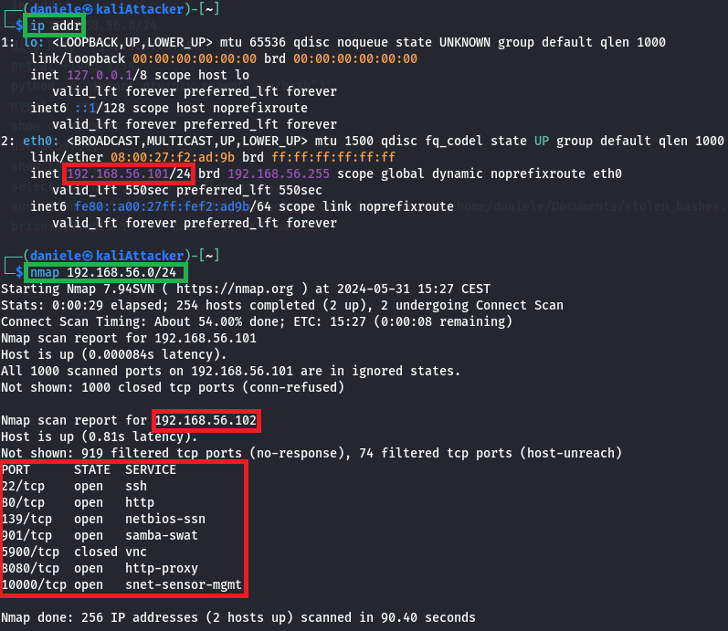
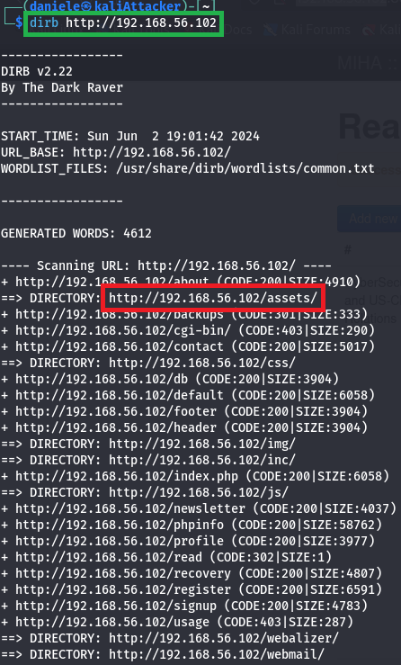

# **Attack on CTF7 Virtual Machine**

**Daniele Maijnelli**

---


### Preliminary information

- The attacking machine is a Kali VM in the same network of the target machine
- The target machine is a VM that can be downloaded at https://www.vulnhub.com/entry/lampsecurity-ctf7,86/
- The objective of the attack is: Gaining root privileges on the target machine
- The threat model is: The attacker can communicate with the target machine
- The attack will be described in terms of the MITRE ATT&CK framework (Tactics and Techniques).

### **Discovery**

The first phase consists in finding information about the target useful for obtaining initial access. For this phase I will use `nmap`, a network exploration tool installed by default on Kali. The first command to execute is `ip addr`, that allows to see the IP address of the attacker machine (`192.168.56.101`) and to obtain the network number (`192.168.56.0/24`). To obtain the IP address of the target machine, I execute `nmap 192.168.56.0/24`, a command that finds all tries to contact all the IP addresses in the network number specified and lists for each of them the reachable port numbers. This command allows to implement the following two techniques.



#### Remote System Discovery 

The IP address of the target machine is `192.168.56.102`.

#### Network Service Discovery

There are several ports reachable, the ones of interest to us are 80 and 8080, both used for HTTP traffic. By visiting on the browser the home page (URL: ```http://192.168.56.102```), we can observe that there is nothing useful to continue the attack, so I try contacting the other port number (URL: `http://192.168.56.102:8080`). In this page, there is a login form.

### **Initial Access**

#### Exploit Public-Facing Application
To proceed, since I don't know the credentials, I try using a SQL injection, that is inserting a username value carefully constructed (the exploit is the HTTP request that answers the form, the payload is the username value `' or 1=1 -- .`) to cause a DBMS to consider it as SQL code inside a query instead of a normal username. For the password, it's possible to leave the field empty, it is not relevant since it will not be considered due to the injected exploit.


### **Persistence**

#### Server Software Component &rarr; Web Shell

To mantain access to the system even across restarts or in the case that the bug causing a SQL injection vulnerability is fixed, we want to upload a web shell on the target machine, to do so we go to the page "Manage Offerings" &rarr; "Reading Room", where it is possible to upload files for logged users. So we click on "Add New", fill the form (if this was a real attack it could be useful to disguise this action as a legitimate one, by putting a realistic name and description). The web shell I inject is already available on every Kali machine at the path `/usr/share/webshells/php/php-reverse-shell.php`, the only configuration required is modifying the script of the web shell with the appropriate IP address (the one of the attacker machine) and port number (in this case I use the default one, 1234) that the web shell will try to connect to. It is important to observe that the web shell installed on the victim machine is not used with HTTP, an HTTP request will only create a process that will execute a shell and then connect its input and output to a TCP connection (the TCP connections goes from the target machine to `IP_address:port_number` specified in the file of the web shell). Therefore, more precisely the uploaded file is a reverse shell on a web server, not a web shell. 


### **Discovery**

To execute the web shell, it is necessary to know where the php file has been stored inside the target machine. To perform this step, I will use `dirb`, it is a directory scanner already included in Kali that searches web servers for hidden files, directories, and pages. It works by sending several HTTP requests to the web server and analyzing the responses, each request differs in the third part of the URL, that is selected based on a customizable dictionary (here I use the default one). 



#### File And Directory Discovery

By analyzing the output of `dirb https://192.168.56.102` in the browser, I found out that the directory containing the web shell is `/assets`. 

### **Execution & Privilege Escalation**

In order to connect to the web shell, I will use `netcat`, a tool already installed in Kali used to establish and use a network connection. In this case I use the command `netcat -lvnp 1234`, that spawns a server process that listens on the port 1234. To start the connection execute the web shell, click on the corresponding file at the URL `https://192.168.56.102/assets`.

#### Command and Scripting Interpreter &rarr; Unix Shell

To have a more complete shell, I invoke the command `python -c 'import pty;pty.spawn("/bin/bash")'`

### **Credential Access**


#### Brute Force &rarr; Password Cracking


### **Credits**
This activity is based on the walkthrough that can be found at the following link.
https://www.hackingarticles.in/hack-the-lampsecurity-ctf-7-ctf-challenge/