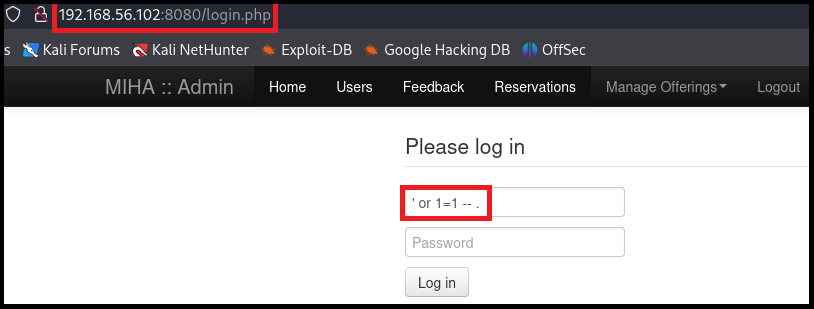
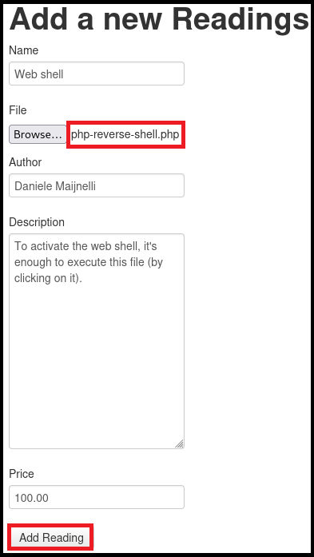
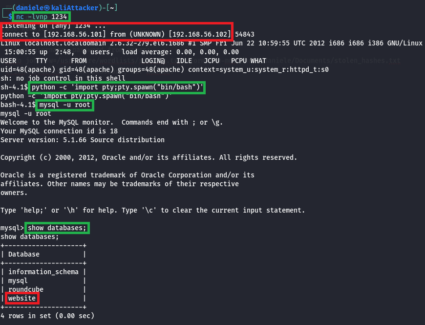
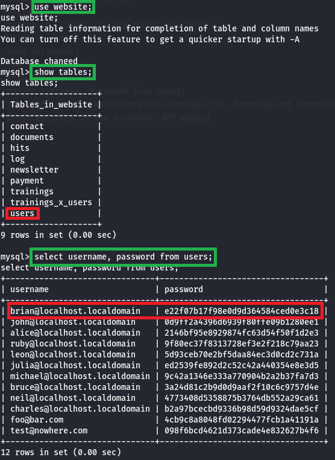
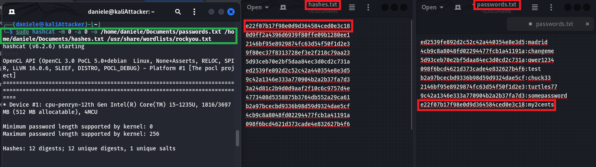
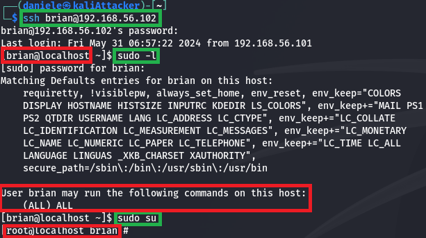

# **Attack on CTF7 Virtual Machine**

**Daniele Maijnelli**

---


### **Preliminary information**

- The attacking machine is a Kali VM in the same network of the target machine
- The target machine is a VM that can be downloaded at https://www.vulnhub.com/entry/lampsecurity-ctf7,86/
- The **objective** of the attack is: Gaining root privileges on the target machine
- The **threat model** is: The attacker can communicate with the target machine
- The attack will be described in terms of the MITRE ATT&CK framework (Tactics and Techniques)
- This activity is based on the walkthrough that can be found at the following link
https://www.hackingarticles.in/hack-the-lampsecurity-ctf-7-ctf-challenge/

### **Discovery**

The first phase consists in finding information about the target that is useful for performing initial access. For this phase I will use `nmap`, a network exploration tool installed by default on Kali. The first command to execute is `ip addr`, that allows to see the IP address of the attacker machine (`192.168.56.101`) and to obtain the network number of the network in which the two machines are placed (`192.168.56.0/24`). To obtain the IP address of the target machine, I execute `nmap 192.168.56.0/24`, a command that tries to contact all the IP addresses in the specified network number and lists for each of them the reachable port numbers. This command allows to implement the following two techniques.


#### Remote System Discovery 

The IP address of the target machine is `192.168.56.102`. Since the machines are not connected to the Internet, there is no gateway, they can only communicate between themselves.

#### Network Service Discovery

There are several ports reachable, the ones of interest to us are 80, 8080 and 22 (this one used later on), both used for HTTP traffic. By visiting the home page (URL: ```http://192.168.56.102```) on the browser, it appears tat there is nothing useful to continue the attack, so I try contacting the other port number (URL: `http://192.168.56.102:8080`). Here there is a login page that can be abused to gain initial access.

### **Initial Access**

#### Exploit Public-Facing Application
To proceed, since I don't know the credentials, I try several usernames with special characters hoping that the system will leak information about the internal functioning through some error messages. Trying with `'` as username and without inserting a password, the system gives the following error message:

`Invalid query: Yout have an error in your SQL syntax; check the manual that corresponds to your MySQL server version for the right syntax to use near "'" AND password=md5(") and is_admin=1' at line 1`
`Whole query: select * from users where username='" AND password=md5(") and is_admin=1`

Now I know that the target machine is using MySQL and also the whole query that is being used. To access as admin, I use a SQL injection, that is inserting a username value carefully constructed (the exploit is the HTTP request that answers the form, the payload is the username value `' or 1=1 -- .`) to cause a DBMS to consider it as SQL code inside a query instead of a normal username. For the password, it's possible to leave the field empty, it is not relevant since it will not be considered due to the injected exploit. The exploit works because the query executed in the target machine after the injection becomes `select * from users where username=' or 1=1 `, the remaining part will be considered as a comment due to the `-- .` part of the exploit.



### **Persistence**

#### Server Software Component &rarr; Web Shell

To mantain access to the system even across restarts or in the case that the bug causing a SQL injection vulnerability is fixed, we want to upload a web shell on the target machine, the objective is to find a page that allows to upload files. Exploring the website, eventually it will be discovered that such a page is reachable for logged users by clicking on "Manage Offerings" &rarr; "Reading Room".
To continue, click on "Add New" and fill the form (if this was a real attack it could be useful to disguise this action as a legitimate one, by putting a realistic name and description for the uploaded file). The web shell I inject is already available on every Kali machine at the path `/usr/share/webshells/php/php-reverse-shell.php`, the only configuration required is modifying the script of the web shell with the appropriate IP address (the one of the attacker machine) and port number (in this case I use the default one, 1234) that the web shell will try to connect to.
It is important to observe that the web shell installed on the victim machine is not used with HTTP, an HTTP request will trigger the target machine to create a process that will execute a shell and then connect its input and output to a TCP connection (the TCP connection goes from the target machine to `IP_address:port_number` specified in the file of the web shell). Therefore, more precisely the uploaded file is a reverse shell on a web server, not a web shell. 



### **Discovery**

To execute the web shell, it is necessary to know where the php file has been stored inside the target machine. To perform this step, I will use `dirb`, it is a directory scanner already included in Kali that searches web servers for hidden files, directories, and pages. It works by sending several HTTP requests to the web server and analyzing the responses, each request differs in the third part of the URL, that is selected based on a customizable dictionary (here I use the default one). 


#### File And Directory Discovery

By analyzing the output of `dirb https://192.168.56.102` in the browser, it's easy to discover that the directory containing the web shell is `/assets`. 

### **Execution**

#### Command and Scripting Interpreter

In order to connect to the web shell, I will use `netcat`, a tool already installed in Kali used to establish and use a network connection. In this case I use the command `netcat -lvnp 1234`, that spawns a server process that listens on the port 1234. Now it is time to execute the web shell, to do so click on the corresponding php file at the URL `https://192.168.56.102/assets`. To have a more complete shell, I invoke the command `python -c 'import pty;pty.spawn("/bin/bash")'`.

### **Privilege escalation**

#### Valid Accounts &rarr; Default Accounts

Before I used a SQL injection to gain initial access, therefore a DBMS is being executed on the target machine, now the objective is to access the databases inside the target machine with root privileges. I abuse the default credentials composed of **username:root** and **password:*blank***, with the command `mysql -u root`.



### **Credential Access**

#### Brute Force &rarr; Credentials from Password Stores

Now the objective is to gain guessing material leveraging the root privileges have just been obtained, to do so I invoke `show databases;`, looking at the output, the `website` database contains the table with the hashes of the passwords, to see its tables I invoke `use website;` and then `show tables;`. Finally, to read the content of the target table, invoke `select username,password from users;`. The users are listed in cleartext, the hashes of the passwords are in MD5 format.



#### Brute Force &rarr; Password Cracking

Now I use Hashcat (a password cracking tool) to obtain the passwords corresponding to the hashes found in the database. In order to perform this step, I invoke

`hashcat -m 0 -a 0 -o /home/daniele/Documents/passwords.txt /home/daniele/Documents/hashes.txt /usr/share/wordlists/rockyou.txt`

Regarding the command:

- `-o /home/daniele/Documents/passwords.txt` specifies the path of the output file, where the cracked passwords will be written.
- `/home/daniele/Documents/hashes.txt` is the path of the file containing the hashes.
- `/usr/share/wordlists/rockyou.txt` is the path of the password dictionary, this one in particular is already installed in every Kali machine.



### **Privilege escalation**

#### Valid Accounts &rarr; Local Accounts

To become root on the target machine, I try the passwords we just found with the corresponding usernames to perform an ssh login with the target machine, hoping in a credential overlap. The result is that **user:brian** and **password:my2cents** are valid. So, the next step is invoking `ssh brian@192.168.56.102` and inserting the password. Then in order to check sudo rights for him invoke `sudo -l`. From the result it appears that he has every sudo right. To complete the attack, I invoke a shell as root on the target machine with `sudo su`.

